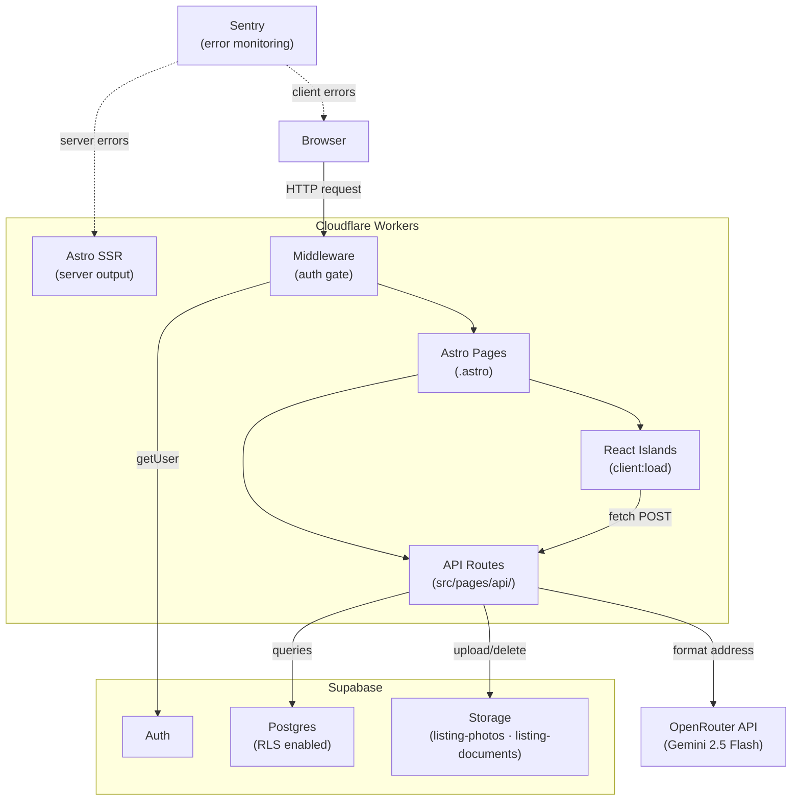
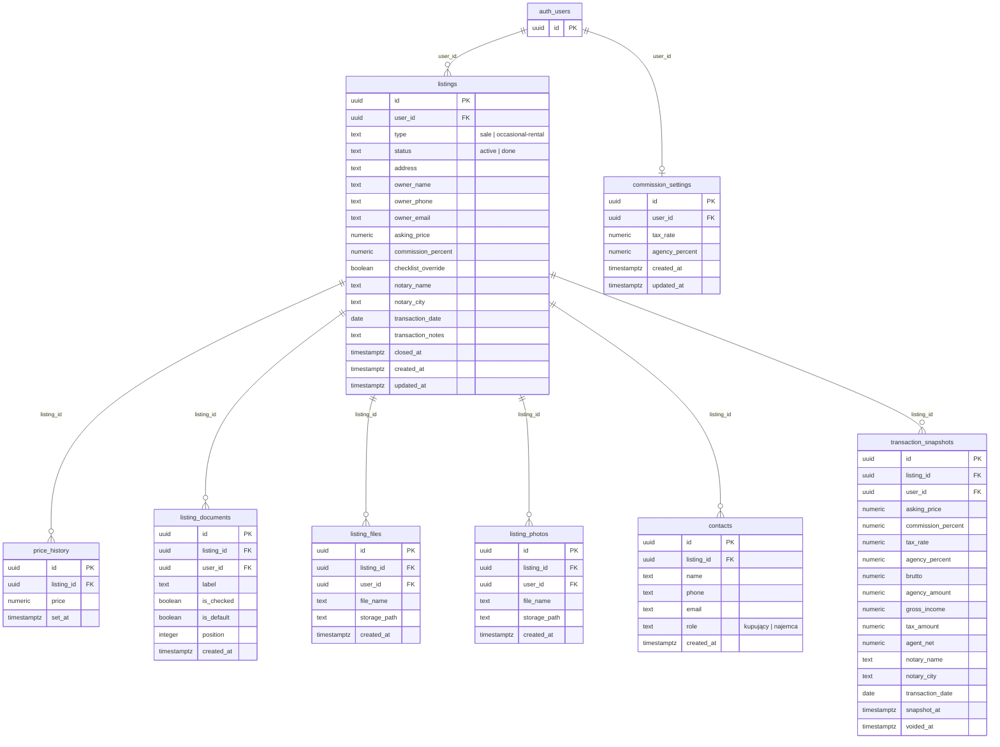
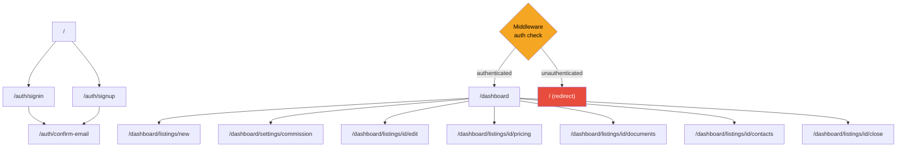
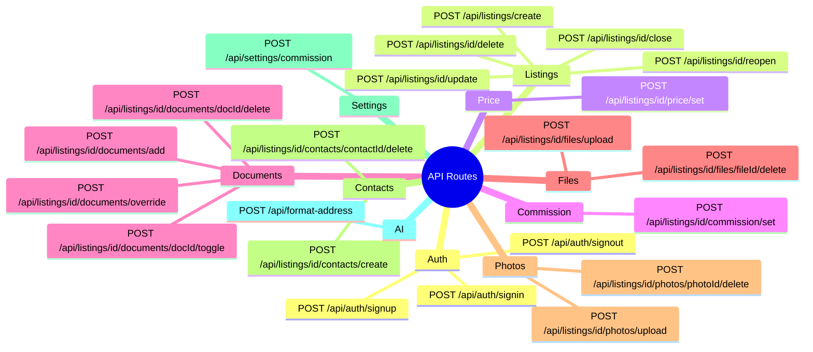
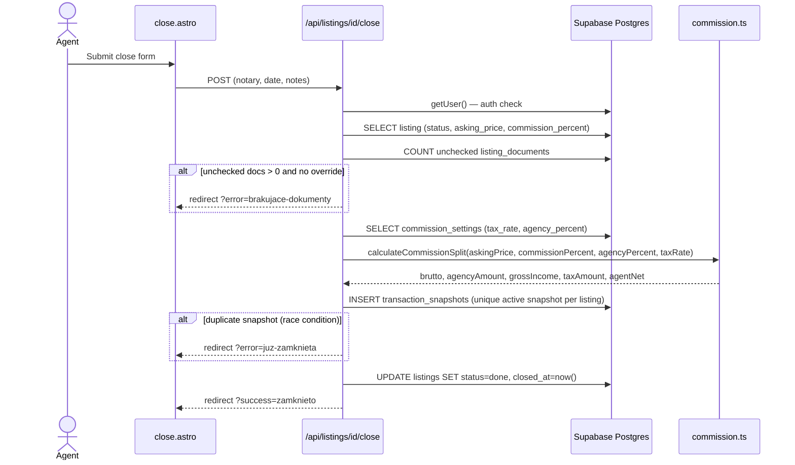

# EstateDesk


A web application for a Polish real estate agent to manage the full lifecycle of property listings — owner onboarding, document collection, buyer/tenant contacts, price negotiations, commission calculations, and transaction close.

## Tech Stack

- [Astro](https://astro.build/) v6 - Modern web framework with server-first rendering
- [React](https://react.dev/) v19 - UI library for interactive components
- [TypeScript](https://www.typescriptlang.org/) v5 - Type-safe JavaScript
- [Tailwind CSS](https://tailwindcss.com/) v4 - Utility-first CSS framework
- [Supabase](https://supabase.com/) - PostgreSQL database, authentication, and file storage
- [Cloudflare Workers](https://workers.cloudflare.com/) - Edge deployment runtime

## Prerequisites

- Node.js v22.14.0 (as specified in `.nvmrc`)
- npm (comes with Node.js)
- [Docker](https://www.docker.com/) for running Supabase locally (~7 GB RAM)

## Getting Started

1. Install dependencies:

```bash
npm install
```

2. Set up Supabase and configure environment variables — see [Supabase Configuration](#supabase-configuration) below.

3. Create a `.dev.vars` file for local Cloudflare dev secrets:

```bash
cp .env.example .dev.vars
```

4. Run the development server:

```bash
npm run dev
```

## Available Scripts

- `npm run dev` - Start development server (Cloudflare workerd runtime)
- `npm run build` - Build for production
- `npm run preview` - Preview production build
- `npm run lint` - Run ESLint with type-checked rules
- `npm run lint:fix` - Auto-fix ESLint issues
- `npm run format` - Run Prettier
- `npm run test` - Run unit tests
- `npm run test:watch` - Run unit tests in watch mode
- `npm run test:integration` - Run integration tests (requires Supabase)
- `npm run test:integration:api` - Run API integration tests (requires Supabase)
- `npm run test:e2e` - Run Playwright end-to-end tests
- `npm run test:e2e:headed` - Run E2E tests in headed mode
- `npm run test:e2e:ui` - Open Playwright UI

## Project Structure

```
.
├── src/
│   ├── components/           # UI components (Astro & React)
│   │   ├── auth/             # Sign-in / sign-up forms
│   │   ├── dashboard/        # Dashboard-specific components
│   │   ├── listings/         # Listing card component
│   │   └── ui/               # Shared UI primitives (shadcn/ui)
│   ├── integration/          # Integration test suites
│   │   ├── api/              # API-level integration tests
│   │   └── helpers/          # Shared test helpers (auth, Supabase client)
│   ├── layouts/              # Astro layouts
│   ├── lib/                  # Shared utilities (commission calc, Supabase client)
│   ├── pages/
│   │   ├── api/              # API endpoints
│   │   │   ├── auth/         # Sign-in, sign-up, sign-out
│   │   │   ├── listings/     # Listing CRUD, close/reopen, pricing, documents,
│   │   │   │                 # contacts, photos, files
│   │   │   └── settings/     # Commission rate configuration
│   │   ├── auth/             # Auth pages (sign-in, sign-up, confirm-email)
│   │   └── dashboard/        # Protected dashboard pages
│   │       ├── listings/     # Listing detail pages (edit, pricing, documents,
│   │       │   [id]/         # contacts, close)
│   │       ├── settings/     # Commission settings
│   │       └── …
│   ├── styles/               # Global CSS
│   └── types/                # TypeScript types (listings, contacts, documents, pricing, transaction)
├── e2e/                      # Playwright E2E tests
├── supabase/
│   └── migrations/           # Database schema migrations
├── public/                   # Public assets
└── wrangler.jsonc            # Cloudflare Workers config
```

## Architecture

### System Overview



### Database Schema (ERD)



### Page Routing & Auth Gates



### API Routes



### Transaction Close Flow



## Supabase Configuration

This project uses [Supabase](https://supabase.com/) for authentication, database (PostgreSQL), and file storage. Environment variables are declared via Astro's `astro:env` schema and are treated as **server-only secrets** — they are never exposed to the client.

### Required environment variables

| Variable                   | Description                                      |
| -------------------------- | ------------------------------------------------ |
| `SUPABASE_URL`             | Project URL                                      |
| `SUPABASE_KEY`             | `anon` public key                                |
| `SUPABASE_SERVICE_ROLE_KEY`| Service role key (used by integration tests only)|

### First-time setup (local)

1. Create your environment file:

```bash
cp .env.example .env
```

2. Initialize the local Supabase project:

```bash
npx supabase init
```

3. Start the local stack (downloads Docker images on first run):

```bash
npx supabase start
```

4. Copy the credentials printed by the CLI into your `.env` and `.dev.vars`:

```
SUPABASE_URL=http://127.0.0.1:54321
SUPABASE_KEY=<anon key from CLI output>
SUPABASE_SERVICE_ROLE_KEY=<service_role key from CLI output>
```

5. Apply database migrations:

```bash
npx supabase db push
```

6. To stop the stack when done:

```bash
npx supabase stop
```

The local Studio UI is available at `http://localhost:54323`.

### Using a cloud Supabase project

If you prefer a hosted project, add these variables to your `.env` and `.dev.vars` files using values from the Supabase dashboard → Settings → API, then run `npx supabase db push` to apply migrations.

### Email confirmation in local development

By default Supabase requires email confirmation before a user can sign in. To skip this during local development:

1. Open the Supabase dashboard for your project
2. Go to **Authentication → Email → Confirm email**
3. Toggle it **off**

### Auth routes

| Route                      | Description                                                             |
| -------------------------- | ----------------------------------------------------------------------- |
| `/auth/signin`             | Email/password sign-in form                                             |
| `/auth/signup`             | Email/password sign-up form                                             |
| `/auth/confirm-email`      | Post-signup "check your inbox" page                                     |
| `/dashboard`               | Listings overview (redirects to `/auth/signin` if unauthenticated)      |
| `/dashboard/listings/new`  | Create a new listing                                                    |
| `/dashboard/listings/[id]` | Listing detail — edit, pricing, documents, contacts, close              |
| `/dashboard/settings/commission` | Configure commission split rates                                  |

Route protection is handled in `src/middleware.ts`. Add paths to the `PROTECTED_ROUTES` array there to require authentication.

## Deployment

This project deploys to [Cloudflare Workers](https://workers.cloudflare.com/). The CI pipeline auto-deploys on every merge to `main` (see CI section below).

To deploy manually:

1. Build the project:

```bash
npm run build
```

2. Deploy with Wrangler:

```bash
npx wrangler deploy
```

3. Set secrets in Cloudflare:

```bash
npx wrangler secret put SUPABASE_URL
npx wrangler secret put SUPABASE_KEY
```

## CI

GitHub Actions runs on every push and PR to `main`:

| Job | Runs | Triggers |
| --- | --- | --- |
| `ci` | lint → unit tests → integration tests → API integration tests → E2E tests → build | push + PR |
| `deploy` | build → `wrangler deploy` | push to `main` only |
| `migrate` | `supabase db push` | after successful deploy |

Configure the following repository secrets in GitHub:

| Secret | Used by |
| --- | --- |
| `SUPABASE_URL` / `SUPABASE_KEY` | Production build |
| `SUPABASE_URL_TEST` / `SUPABASE_ANON_KEY_TEST` / `SUPABASE_SERVICE_ROLE_KEY_TEST` | Tests in CI |
| `CLOUDFLARE_API_TOKEN` / `CLOUDFLARE_ACCOUNT_ID` | Wrangler deploy |
| `SUPABASE_PROJECT_REF` / `SUPABASE_ACCESS_TOKEN` / `SUPABASE_DB_PASSWORD` | Migration push |

## License

MIT
