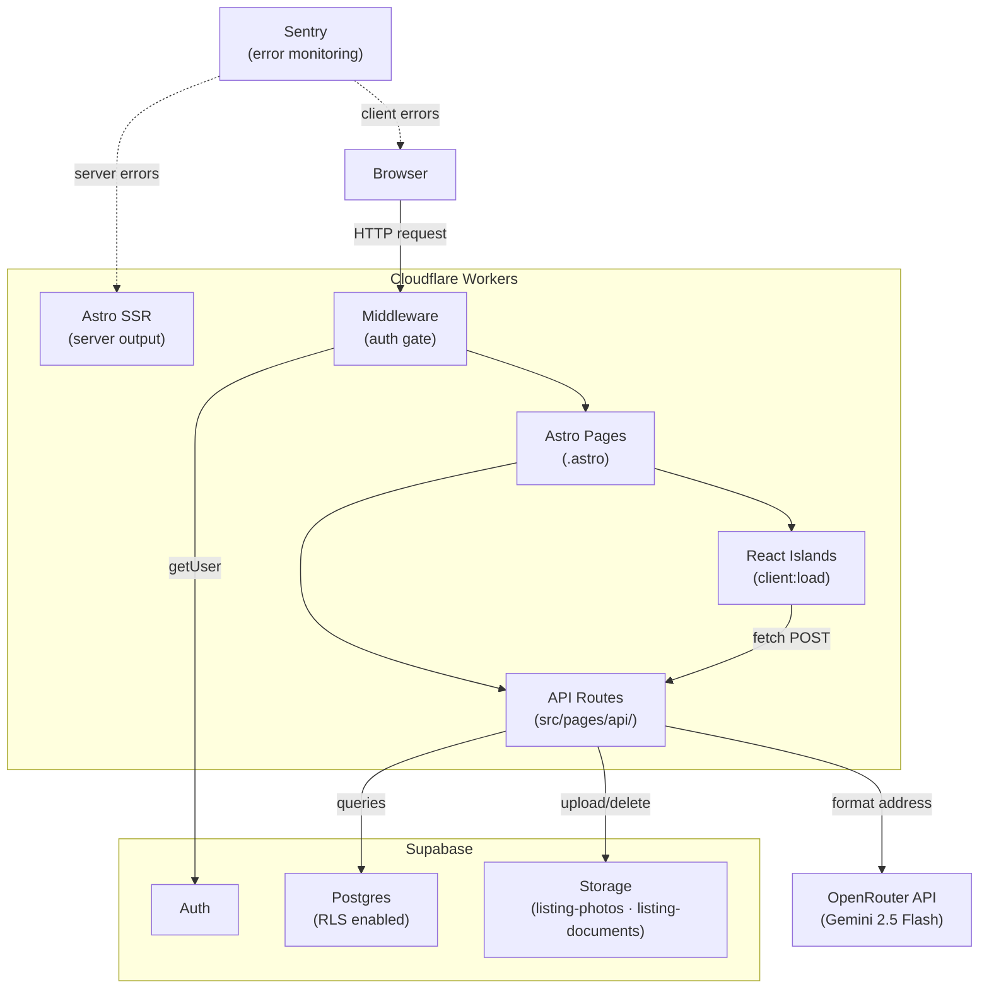
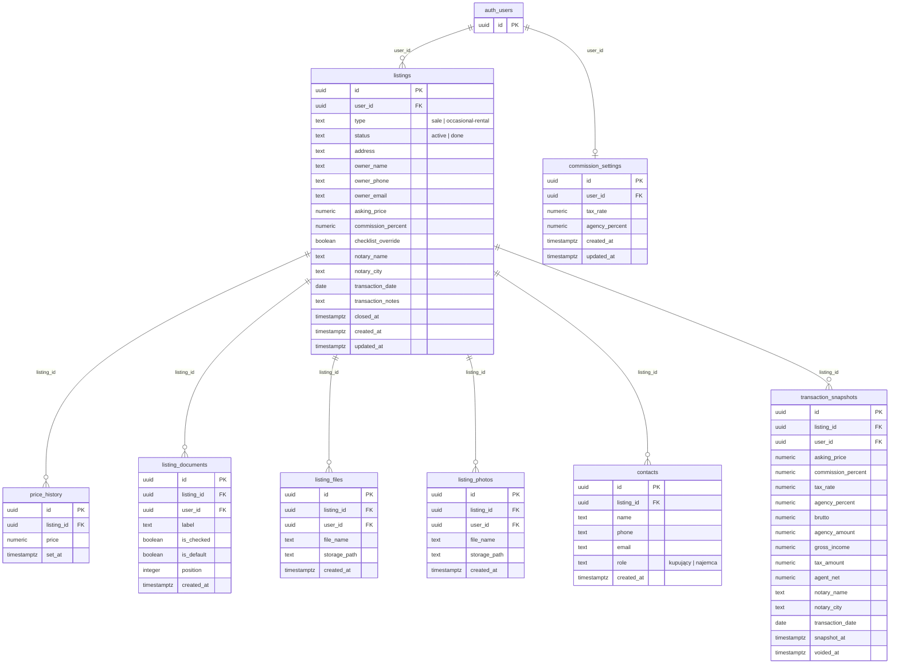
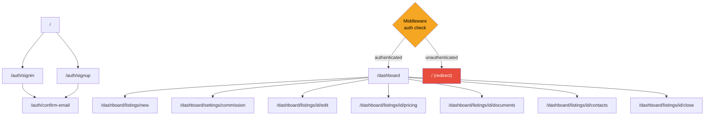
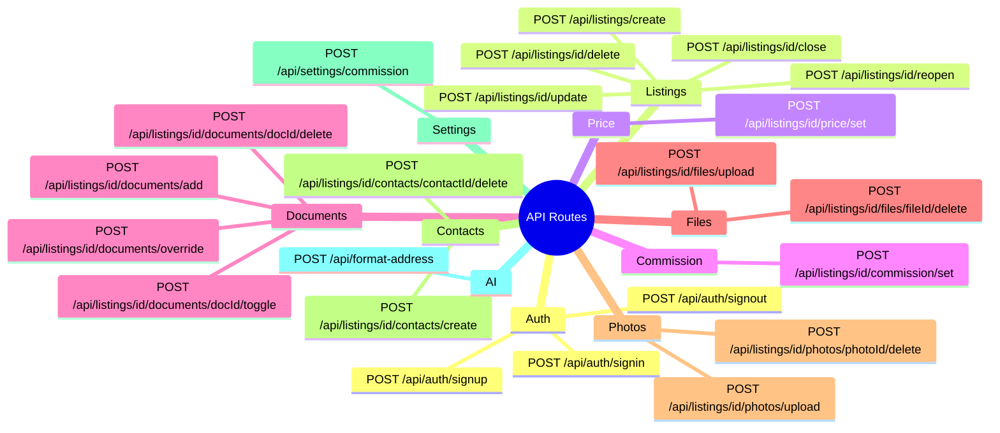
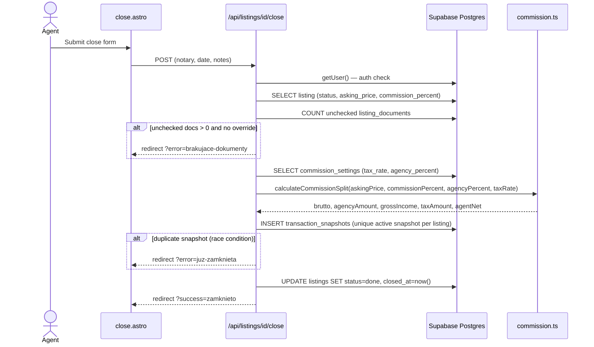

# EstateDesk — Architecture Diagrams

## 1. System Overview

```mermaid
graph TD
    Browser["Browser"]

    subgraph CF["Cloudflare Workers"]
        Astro["Astro SSR\n(server output)"]
        MW["Middleware\n(auth gate)"]
        Pages["Astro Pages\n(.astro)"]
        Islands["React Islands\n(client:load)"]
        API["API Routes\n(src/pages/api/)"]
    end

    subgraph Supabase["Supabase"]
        Auth["Auth"]
        DB["Postgres\n(RLS enabled)"]
        Storage["Storage\n(listing-photos · listing-documents)"]
    end

    OpenRouter["OpenRouter API\n(Gemini 2.5 Flash)"]
    Sentry["Sentry\n(error monitoring)"]

    Browser -->|HTTP request| MW
    MW -->|getUser| Auth
    MW --> Pages
    Pages --> Islands
    Pages --> API
    API -->|queries| DB
    API -->|upload/delete| Storage
    API -->|format address| OpenRouter
    Islands -->|fetch POST| API
    Sentry -.->|client errors| Browser
    Sentry -.->|server errors| Astro
```

## 2. Database Schema (ERD)

```mermaid
erDiagram
    auth_users {
        uuid id PK
    }

    listings {
        uuid id PK
        uuid user_id FK
        text type "sale | occasional-rental"
        text status "active | done"
        text address
        text owner_name
        text owner_phone
        text owner_email
        numeric asking_price
        numeric commission_percent
        boolean checklist_override
        text notary_name
        text notary_city
        date transaction_date
        text transaction_notes
        timestamptz closed_at
        timestamptz created_at
        timestamptz updated_at
    }

    commission_settings {
        uuid id PK
        uuid user_id FK
        numeric tax_rate
        numeric agency_percent
        timestamptz created_at
        timestamptz updated_at
    }

    price_history {
        uuid id PK
        uuid listing_id FK
        numeric price
        timestamptz set_at
    }

    listing_documents {
        uuid id PK
        uuid listing_id FK
        uuid user_id FK
        text label
        boolean is_checked
        boolean is_default
        integer position
        timestamptz created_at
    }

    listing_files {
        uuid id PK
        uuid listing_id FK
        uuid user_id FK
        text file_name
        text storage_path
        timestamptz created_at
    }

    listing_photos {
        uuid id PK
        uuid listing_id FK
        uuid user_id FK
        text file_name
        text storage_path
        timestamptz created_at
    }

    contacts {
        uuid id PK
        uuid listing_id FK
        text name
        text phone
        text email
        text role "kupujący | najemca"
        timestamptz created_at
    }

    transaction_snapshots {
        uuid id PK
        uuid listing_id FK
        uuid user_id FK
        numeric asking_price
        numeric commission_percent
        numeric tax_rate
        numeric agency_percent
        numeric brutto
        numeric agency_amount
        numeric gross_income
        numeric tax_amount
        numeric agent_net
        text notary_name
        text notary_city
        date transaction_date
        timestamptz snapshot_at
        timestamptz voided_at
    }

    auth_users ||--o{ listings : "user_id"
    auth_users ||--o| commission_settings : "user_id"
    listings ||--o{ price_history : "listing_id"
    listings ||--o{ listing_documents : "listing_id"
    listings ||--o{ listing_files : "listing_id"
    listings ||--o{ listing_photos : "listing_id"
    listings ||--o{ contacts : "listing_id"
    listings ||--o{ transaction_snapshots : "listing_id"
```

## 3. Page Routing & Auth Gates

```mermaid
flowchart TD
    Root["/"]
    SignIn["/auth/signin"]
    SignUp["/auth/signup"]
    Confirm["/auth/confirm-email"]
    Dashboard["/dashboard"]
    New["/dashboard/listings/new"]
    Edit["/dashboard/listings/id/edit"]
    Pricing["/dashboard/listings/id/pricing"]
    Docs["/dashboard/listings/id/documents"]
    Contacts["/dashboard/listings/id/contacts"]
    Close["/dashboard/listings/id/close"]
    Settings["/dashboard/settings/commission"]

    Gate{"Middleware\nauth check"}
    Redirect["/  (redirect)"]

    Root --> SignIn & SignUp
    SignIn & SignUp --> Confirm

    Gate -->|authenticated| Dashboard
    Gate -->|unauthenticated| Redirect

    Dashboard --> New & Settings
    Dashboard --> Edit & Pricing & Docs & Contacts & Close

    style Gate fill:#f5a623,color:#000
    style Redirect fill:#e74c3c,color:#fff
```

## 4. API Routes

```mermaid
mindmap
  root((API Routes))
    Auth
      POST /api/auth/signin
      POST /api/auth/signup
      POST /api/auth/signout
    Listings
      POST /api/listings/create
      POST /api/listings/id/update
      POST /api/listings/id/delete
      POST /api/listings/id/close
      POST /api/listings/id/reopen
    Price
      POST /api/listings/id/price/set
    Commission
      POST /api/listings/id/commission/set
    Documents
      POST /api/listings/id/documents/add
      POST /api/listings/id/documents/override
      POST /api/listings/id/documents/docId/toggle
      POST /api/listings/id/documents/docId/delete
    Files
      POST /api/listings/id/files/upload
      POST /api/listings/id/files/fileId/delete
    Photos
      POST /api/listings/id/photos/upload
      POST /api/listings/id/photos/photoId/delete
    Contacts
      POST /api/listings/id/contacts/create
      POST /api/listings/id/contacts/contactId/delete
    Settings
      POST /api/settings/commission
    AI
      POST /api/format-address
```

## 5. Transaction Close Flow

```mermaid
sequenceDiagram
    actor Agent
    participant Page as close.astro
    participant API as /api/listings/id/close
    participant DB as Supabase Postgres
    participant Calc as commission.ts

    Agent->>Page: Submit close form
    Page->>API: POST (notary, date, notes)
    API->>DB: getUser() — auth check
    API->>DB: SELECT listing (status, asking_price, commission_percent)
    API->>DB: COUNT unchecked listing_documents
    alt unchecked docs > 0 and no override
        API-->>Page: redirect ?error=brakujace-dokumenty
    end
    API->>DB: SELECT commission_settings (tax_rate, agency_percent)
    API->>Calc: calculateCommissionSplit(askingPrice, commissionPercent, agencyPercent, taxRate)
    Calc-->>API: brutto, agencyAmount, grossIncome, taxAmount, agentNet
    API->>DB: INSERT transaction_snapshots (unique active snapshot per listing)
    alt duplicate snapshot (race condition)
        API-->>Page: redirect ?error=juz-zamknieta
    end
    API->>DB: UPDATE listings SET status=done, closed_at=now()
    API-->>Page: redirect ?success=zamknieto
```
