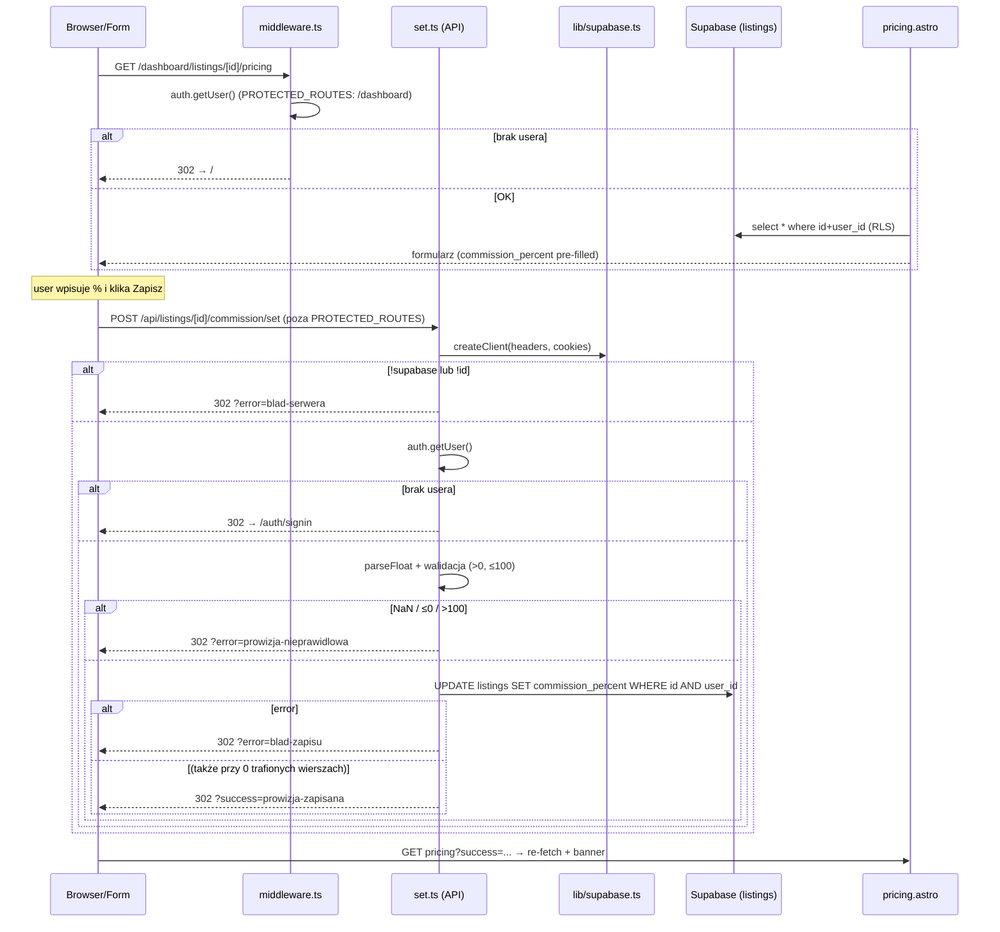

# Research: Przepływ `src/pages/api/listings/[id]/commission/set.ts`

**Date**: 2026-06-10T21:03:00+02:00
**Researcher**: Claude (Fable 5)
**Git Commit**: `f22b961cbfaade2bd85332f92ceaae202c01e398` (pushed; permalink base:
`https://github.com/cieyhomelab/estate-desk/blob/f22b961cbfaade2bd85332f92ceaae202c01e398/`)
**Branch**: main
**Repository**: estate-desk

## Research Question

Przeanalizuj przepływ w `src/pages/api/listings/[id]/commission/set.ts`, ze szczególnym
uwzględnieniem powiązań z `context/map/repo-map.md` (strefa ryzyka #1). Trzy równoległe
osie: (1) trace e2e z file:line i diagramem Mermaid, (2) luki w pokryciu testami metod
i gałęzi na ścieżce, (3) blast radius — graf statyczny + co-change z historii gita.
Wyłącznie analiza stanu obecnego. Raport z jawnymi sekcjami Feature overview /
Technical debt i rozdziałem evidence / inference / unknown.

---

## Summary

`commission/set.ts` to **34-linijkowa, write-only trasa formularzowa**: formularz na
`pricing.astro` → POST → auth check → walidacja `parseFloat` (`>0`, `≤100`) → `UPDATE
listings.commission_percent` → redirect z flash-slugiem. Trasa **nie liczy** podziału
prowizji — `calculateCommissionSplit()` z `src/lib/commission.ts` jest wołane wyłącznie
przy odczycie (pricing/close preview, snapshot przy zamknięciu).

Trzy najważniejsze ustalenia:

1. **Zero bezpośredniego pokrycia testami.** Żaden test (unit / integration / e2e) nie
   wykonuje POST na `/commission/set`. Repo-mapa twierdziła "pokryta tylko przez e2e lub
   wcale" — stan faktyczny to **wcale**: e2e seeduje `commission_percent` bezpośrednio
   w DB, nigdy przez formularz. Wszystkie 5 gałęzi trasy + edge-case'y walidacji są
   niepokryte (macierz niżej).
2. **Flaga ryzyka z repo-mapy częściowo się deeskaluje.** Podejrzane commity drugiego
   autora (`1eff78a` "Fix commission update logic", `465a157`) to **czysty whitespace
   churn** — zero zmian behawioralnych. "Dwóch autorów + poprawki bez opisu" to szum,
   ale ryzyko "pieniądze + zero testów" pozostaje w pełni aktualne.
3. **Prawdopodobny cichy fałszywy sukces (inference, do weryfikacji runtime).** UPDATE
   z `.eq("id", id).eq("user_id", user.id)` trafiający 0 wierszy (cudzy listing /
   nieistniejące id) nie zwraca błędu w supabase-js → trasa robi redirect
   `?success=prowizja-zapisana` mimo braku zapisu.

Empiryczny minimalny zestaw zmiany (commit narodzin `bce5cc9`): trasa + `pricing.astro`
+ `types/listings.ts` + migracja. Graf statyczny dokłada 5 cichszych punktów sprzężenia,
których git jeszcze nie przećwiczył (sekcja Blast radius).

---

## 1. Feature overview

### Czym jest ten feature

Ustawianie procentu prowizji agenta na pojedynczym listingu. Część slice'a S-03
"Pricing and commission split" (archiwum `2026-05-29-pricing-and-commission`). Wartość
jest potem konsumowana przez podgląd podziału prowizji (pricing/close) i przez snapshot
transakcji przy zamknięciu listingu.

### Trace end-to-end (sekwencja kroków, file:line)

**Faza A — render formularza (GET):**

1. Browser → GET `/dashboard/listings/[id]/pricing`.
2. `src/middleware.ts:4` — `PROTECTED_ROUTES = ["/dashboard", "/help"]`; ścieżka pasuje,
   `src/middleware.ts:18-22` przekierowuje na `/` przy braku usera. [EVIDENCE]
3. `src/pages/dashboard/listings/[id]/pricing.astro:18` — `createClient(Astro.request.headers, Astro.cookies)`;
   `:28-36` — `select("*").eq("id", id).eq("user_id", user.id)`. [EVIDENCE]
4. `pricing.astro:174` — `<form method="POST" action={`/api/listings/${id}/commission/set`}>`;
   `:180-189` — input `name="commission_percent"`, `step="0.01" min="0.01" max="100"`,
   `value={listing.commission_percent ?? ""}`. [EVIDENCE]
5. `pricing.astro:68-75` — bieżąca wartość idzie do `calculateCommissionSplit()`
   (podgląd podziału); `:168-171` — "Aktualna prowizja: {…}%". [EVIDENCE]

**Faza B — zapis (POST):**

6. Browser → POST `/api/listings/[id]/commission/set`. Trasa API **nie jest** w
   `PROTECTED_ROUTES` — middleware ją przepuszcza; auth jest egzekwowany wewnątrz
   handlera (wzorzec z CLAUDE.md §2). [EVIDENCE `middleware.ts:4` + INFERENCE co do intencji]
7. `set.ts:6` — `createClient(...)`; `src/lib/supabase.ts:5-24` zwraca `null`, gdy
   brakuje `SUPABASE_URL`/`SUPABASE_KEY`. `set.ts:8-10` — `!supabase || !id` →
   redirect `?error=blad-serwera`. [EVIDENCE]
8. `set.ts:12-17` — `supabase.auth.getUser()`; brak usera → redirect `/auth/signin`. [EVIDENCE]
9. `set.ts:19-21` — `parseFloat(form.get("commission_percent") ?? "")`. [EVIDENCE]
10. `set.ts:23-25` — `isNaN || <= 0 || > 100` → redirect `?error=prowizja-nieprawidlowa`. [EVIDENCE]
11. `set.ts:27` — `supabase.from("listings").update({ commission_percent }).eq("id", id).eq("user_id", user.id)`. [EVIDENCE]
    - Kolumna: `supabase/migrations/20260530100000_add_commission_percent_to_listings.sql:3-4`
      — `numeric(5,2)` + CHECK `(> 0 and <= 100)`. [EVIDENCE]
    - RLS: `supabase/migrations/20260525152607_create_listings.sql:21-24` — polityka
      `owners_own_listings`, `auth.uid() = user_id`, `for all`. [EVIDENCE]
12. `set.ts:29-31` — błąd → `?error=blad-zapisu`; `set.ts:33` — sukces →
    `?success=prowizja-zapisana`. [EVIDENCE]

**Faza C — re-render z flash message:**

13. `pricing.astro:82-83` — odczyt `?error` / `?success`; `:106` renderuje
    "Prowizja agenta została pomyślnie zapisana." dla `prowizja-zapisana`; `:108-110`
    komunikat dla `prowizja-nieprawidlowa`; `:96-100` generyczny fallback (łapie
    `blad-serwera` i `blad-zapisu`). Strona re-fetchuje listing (`:31-41`), więc
    formularz pokazuje świeżą wartość. [EVIDENCE]

### Diagram Mermaid

### Konsumenci `commission_percent` downstream (odczyt)

| Miejsce | Co robi |
|---|---|
| `pricing.astro:68-75, 168-171, 186` | podgląd podziału + wyświetlenie + pre-fill inputu |
| `close.astro:28, 82-89` | podgląd podziału przed zamknięciem |
| `close.ts:32,35` (select), `:73-85` (split), `:91` (kopia do `transaction_snapshots`) | snapshot finansowy przy zamknięciu |
| `src/lib/commission.ts:3,16-19` | kalkulator `calculateCommissionSplit({ commissionPercent })` — **szew zmiany nazwy** snake_case→camelCase na każdym call site |
| `src/types/listings.ts:16`, `src/types/transaction.ts:6` (`TransactionSnapshot`) | dwie ręczne kopie typu `number \| null` |
| `supabase/seed.sql:32,290` | dane seedowe (`listings` + `transaction_snapshots`) |
| `src/lib/csv.test.ts:18` | fixture pełnego `Listing` z `commission_percent: null` — cichy punkt sprzężenia przy rename pola [AST-GREP] |

Produkcyjne call site'y kalkulatora — dokładnie 3 (ast-grep `calculateCommissionSplit($$$)`):
wywołania zaczynają się w `pricing.astro:69`, `close.astro:84`, `close.ts:74` (linie
`:71/:86/:76` cytowane niżej to argument `commissionPercent` wewnątrz tych wywołań);
do tego 4 wywołania testowe w `commission.test.ts:8,22,34,50`. [EVIDENCE — ast-grep]

**Nie konsumują** (zweryfikowana nieobecność, ast-grep + grep): `src/lib/csv.ts` (eksport CSV nie
zawiera prowizji — nagłówek `csv.ts:3`), `DashboardListings.tsx`, `edit.astro`. [EVIDENCE]

Kluczowy wniosek projektowy [INFERENCE]: `set.ts` jest write-only — cała matematyka
prowizji żyje w warstwie odczytu. Zmiana walidacji w trasie nie dotyka kalkulatora,
ale zmiana jednostki/semantyki pola dotyka wszystkiego z tabeli wyżej.

---

## 2. Technical debt

### 2.1 Zero pokrycia testami trasy (najpoważniejsze)

W repo są **22 trasy API** (ast-grep `export const $VERB: APIRoute` — 22 pliki, każdy
dokładnie 1 handler `POST`). Bezpośrednio (HTTP w testach integracyjnych) przetestowane:
**4 z 22** — `create`, `close`, `contacts/create`, `documents/add`
(`auth-boundary.test.ts:7-61`, `idor.test.ts:71-116`, `gate-logic.test.ts:8`).
E2e ćwiczy przez formularze UI dodatkowo `update` („Zapisz zmiany",
`listing-persistence.spec.ts:70`) i `reopen` („Wznów transakcję",
`close-reopen-lifecycle.spec.ts:82`) — łącznie **6 z 22** tras ma jakiekolwiek pokrycie
wykonania; logowanie w e2e idzie przez `signInWithPassword` w helperze
(`e2e/helpers/auth.ts:46`), więc trasy `auth/*` też są niećwiczone. `commission/set`
nie ma żadnego testu; grep za URL-em trafia tylko `pricing.astro:174`. [EVIDENCE — ast-grep + grep]

Macierz gałęzi `set.ts`:

| Gałąź | Warunek (linia) | Pokrycie |
|---|---|---|
| B1 | `!supabase \|\| !id` → `?error=blad-serwera` (`:8`) | UNCOVERED |
| B2 | brak usera → `/auth/signin` (`:15`) | UNCOVERED — wzorzec auth-boundary istnieje (`auth-boundary.test.ts:7-61`), ale nie obejmuje tej trasy |
| B3 | `isNaN \|\| ≤0 \|\| >100` (`:23`) | UNCOVERED — w tym edge-case'y `""`, `"50%"`→50, `"1e2"`→100, `",5"`→NaN, `" 50 "`→50 |
| B4 | błąd DB → `?error=blad-zapisu` (`:29`) | UNCOVERED |
| B5 | sukces (`:33`) | UNCOVERED — happy path bez weryfikacji wiersza w DB |
| ownership no-op | UPDATE trafia 0 wierszy → B5 | UNCOVERED — wzorzec IDOR istnieje (`idor.test.ts:71-116`), nie obejmuje tej trasy |

Pokrycie styczne, które NIE liczy się jako pokrycie trasy:
- `src/lib/commission.test.ts:5-62` — 4 case'y kalkulatora (oracle z PRD, zera, 100%
  agencji, zaokrąglenia groszy). `set.ts` nie importuje kalkulatora. [EVIDENCE]
- `e2e/close-reopen-lifecycle.spec.ts:32` — seeduje `commission_percent: 2` w
  `listings` bezpośrednio w DB; `src/integration/listing-close-reopen.test.ts:54-60`
  wstawia `commission_percent: 2` do **`transaction_snapshots`** (snapshot, nie
  listing; odczyt/assert `:78-85`). Żaden nie przechodzi przez formularz ani trasę. [EVIDENCE]
- Infrastruktura: testy integracyjne używają `createServiceRoleClient()`
  (`src/integration/helpers/supabase.ts:1-12`) — omija RLS i auth, więc B2 wymaga
  wzorca cookie-based (`src/integration/helpers/auth.ts:1-33`,
  `getAuthCookieHeader()`), który już istnieje i czeka na użycie. [EVIDENCE]

Konsekwencja [INFERENCE]: zmiana zakresu walidacji albo nazwy pola wyjdzie na
produkcję bez ani jednego czerwonego testu.

### 2.2 Cichy fałszywy sukces przy 0 trafionych wierszach

`set.ts:27` filtruje `.eq("user_id", user.id)` (ochrona IDOR — poprawna), ale UPDATE
trafiający 0 wierszy nie jest błędem w supabase-js → `error` jest `null` → B5 →
`?success=prowizja-zapisana` mimo braku zapisu. [INFERENCE — wysokie zaufanie,
standardowa semantyka supabase-js; runtime niezweryfikowany — patrz Open Questions.
Uwaga: agent trace'ujący wnioskował przeciwnie (RLS → error → `blad-zapisu`);
rozstrzygnięcie wymaga jednego testu integracyjnego.]

Zasięg problemu jest szerszy niż ta trasa: kształt
`.update($$$).eq("id", $A).eq("user_id", $B)` występuje w **7 trasach** (ast-grep):
`commission/set.ts:27`, `update.ts:38-42`, `reopen.ts:51-55`,
`documents/override.ts:25-29`, `documents/[docId]/toggle.ts:25-29`,
`close.ts:109-120`, `price/set.ts:39-43` — rozstrzygnięcie semantyki 0-row UPDATE
dotyczy całej konwencji repo. Istniejące testy IDOR nie odpowiadają na to pytanie:
`idor.test.ts:71-91` testuje `close` (cudzy listing wykrywany przez wcześniejszy
`select().single()` → `nie-znaleziono`), a `:93-116` testuje INSERT pod RLS
(`contacts/create` → error → `blad-zapisu`) — żaden nie pokrywa czystego 0-row
UPDATE bez wcześniejszego selecta. [EVIDENCE — ast-grep]

### 2.3 Redirect z `undefined` w URL

`set.ts:8-9`: gdy gałąź B1 odpala się z powodu `!id`, redirect interpoluje to samo
falsy `id` → `/dashboard/listings/undefined/pricing?error=blad-serwera`. [EVIDENCE
`set.ts:8-9` + INFERENCE co do wyniku]

### 2.4 Stringly-typed szwy bez współdzielonej warstwy

- Nazwa pola formularza: `pricing.astro:182` ↔ `set.ts:20` — ręczna synchronizacja. [EVIDENCE]
- Flash-slugi: emitowane w `set.ts:9,24,30,33`, renderowane w (co najmniej) trzech
  RÓŻNYCH wzorcach w repo — inline ternary (`pricing.astro:96-100,106,108-110`,
  ten sam wzorzec też `documents.astro:95` i `settings/commission.astro:55`),
  obiekt-mapa (`contacts.astro:62`), includes-lista (`close.astro:122-124`). Brak
  współdzielonej mapy; `blad-serwera` nie ma dedykowanego komunikatu (wpada w fallback).
  Slug `blad-zapisu` jest **współdzielony przez 11 tras** (grep: m.in. `price/set.ts:34,46`,
  `settings/commission.ts:42`, `reopen.ts` ×4, `close.ts` ×4, `contacts/create.ts:50`,
  `documents/add.ts:61`, `documents/override.ts:32`, `documents/[docId]/toggle.ts:32`,
  `files/upload.ts:62`, `photos/upload.ts:67`) — ternary w `pricing.astro:98-100`
  powstał dla `price/set` (stąd "Nie udało się zapisać **ceny**"), a `commission/set`
  dosiadł się do tego samego sluga na tej samej stronie: komunikat cenowy dla błędu
  prowizji. [EVIDENCE — ast-grep/grep]
- Brak wygenerowanych typów DB (brak `database.types.ts` — zweryfikowana nieobecność):
  klient supabase-js nietypowany, kolumna utrzymywana ręcznie w DWÓCH typach
  (`listings.ts:16`, `transaction.ts:6`). [EVIDENCE]

### 2.5 Rozjazdy walidacji między warstwami

- Trasa (`>0, ≤100`) zgodna z CHECK na `listings` — ale `numeric(5,2)` dodatkowo
  ogranicza precyzję; `2.999` przechodzi walidację trasy i jest cicho zaokrąglane
  przez Postgres. [EVIDENCE migracja + INFERENCE zaokrąglenie]
- Kopia w `transaction_snapshots.commission_percent`
  (`20260530120000_transaction_close.sql:12,17`) **nie ma żadnego CHECK** — snapshot może
  pomieścić wartości, których kolumna źródłowa by nie przyjęła. [EVIDENCE]
- Walidacja kliencka (`min="0.01"`) vs serwerowa (`> 0`) mają różne dolne granice —
  kosmetyczne, ale to trzecia niezależna kopia reguły. [EVIDENCE]

### 2.6 Brak guardu stanu listingu

`set.ts` nie sprawdza, czy listing jest zamknięty (`status`) — prowizję można zmienić
po zamknięciu transakcji; snapshot w `transaction_snapshots` zachowa starą wartość, więc
rozjazd listing↔snapshot jest możliwy. [EVIDENCE — brak sprawdzenia w kodzie;
INFERENCE — czy to bug czy zamierzona elastyczność, nieustalone.]

### 2.7 Higiena historii gita (deeskalacja flagi z repo-mapy)

Wszystkie commity dotykające `set.ts` (5, wszystkie 2026-05-30):

| Hash | Autor | Treść rzeczywista |
|---|---|---|
| `bce5cc9` | Maciej | narodziny logiki — razem z `pricing.astro` + `types/listings.ts` + migracją [EVIDENCE] |
| `1a74be3` | Maciej | drive-by reformat (lint:fix) przy pracy nad dokumentami [EVIDENCE] |
| `465a157` | cieyhomelab | czysty formatting — sklejenie łańcucha supabase do 1 linii [EVIDENCE — diff] |
| `1eff78a` | cieyhomelab | **mimo tytułu "Fix commission update logic" — zmiana 1 znaku wcięcia, zero logiki** [EVIDENCE — diff] |
| `967c6d1` | cieyhomelab | revert wcięcia z `1eff78a` [EVIDENCE] |

(`304cdc6` dotyka tylko `pricing.astro` — usunięcie dwóch `!` non-null assertions.)
Wniosek: "poprawki bez opisu" z repo-mapy to pętla whitespace churn, nie ukryta zmiana
zachowania. Mylący komunikat commitu `1eff78a` to sam w sobie dług (zaufanie do
historii), ale pytanie z repo-mapy "co naprawiał cieyhomelab?" ma odpowiedź: **nic**.

---

## Blast radius — co musi zmienić się razem

### Dowód empiryczny (git co-change)

Jedyny commit zmieniający *zachowanie* (`bce5cc9`) dotknął dokładnie: trasa +
`pricing.astro` + `types/listings.ts` + migracja. To empirycznie wykazane minimum.
[EVIDENCE]

Tandem `pricing.astro ↔ edit.astro` z repo-mapy: 5 z 10 commitów pricing dotyka też
edit, ale **każdy** wspólny commit to sweep nawigacyjno-stylingowy po wszystkich
stronach listingu (`11ed58b`, `1a74be3`, `151e2d2`, `74af929`, `52a44ca`) —
`edit.astro` nie zawiera kodu prowizji. Co-change jako "członkowie zestawu stron
detalu listingu", nie tandem prowizyjny. [EVIDENCE + INFERENCE]

### Checklist zmiany (graf statyczny + git)

Przy modyfikacji przepływu (zakres walidacji / rename pola / waluta):

| # | Artefakt | Lokalizacja | Źródło dowodu |
|---|---|---|---|
| 1 | Trasa | `set.ts:20` (klucz formularza), `:23` (walidacja), `:27` (update), `:9,24,30,33` (slugi) | static + git `bce5cc9` |
| 2 | Formularz | `pricing.astro:174` (URL), `:176-189` (name/min/max/step/value), `:168-171` (wyświetlenie) | static + git `bce5cc9` |
| 3 | Render banerów | `pricing.astro:96-110` | static |
| 4 | Migracja | nowy plik; parity z CHECK `20260530100000:3-4`; też `transaction_snapshots` (`20260530120000:17`, bez CHECK) | static + git `bce5cc9` |
| 5 | Typy ręczne (brak warstwy generowanej) | `types/listings.ts:16`, `types/transaction.ts:6` | static + git `bce5cc9` |
| 6 | Kalkulator + szew rename | `lib/commission.ts:3` i call sites `pricing.astro:69-75`, `close.astro:84-89`, `close.ts:74-79` | static (ast-grep: dokładnie 3 produkcyjne) |
| 7 | Snapshot zamknięcia | `close.ts:32,35,73,91` (select stringiem + kopia do `transaction_snapshots`) | static |
| 8 | Testy unit | `lib/commission.test.ts` — 4 × `it()` (`:5,21,33,45`; wartości `commissionPercent` w `:10,24,36,52`) | static (ast-grep) |
| 9 | Test integracyjny | `integration/listing-close-reopen.test.ts:58,79,85` (kolumna stringiem w insert/`.select()` na `transaction_snapshots`) | static |
| 10 | E2E | `e2e/close-reopen-lifecycle.spec.ts:32` (seed), `:76` (string UI "Brak danych prowizji") | static |
| 11 | Seed | `supabase/seed.sql:32,290` | static |
| 12 | Fixture testowe | `lib/csv.test.ts:18` (pełny obiekt `Listing` z `commission_percent`) | static (ast-grep) |
| 13 | No-op (zweryfikowana nieobecność) | csv.ts (produkcyjny), DashboardListings.tsx, edit.astro, typy generowane | static |

Graf statyczny i git zgadzają się co do rdzenia (1, 2, 4, 5); pozycje 6–12 to cichsze
sprzężenia, których historia gita jeszcze nie przećwiczyła. [EVIDENCE + INFERENCE]

---

## Weryfikacja strukturalna (ast-grep, 2026-06-10)

Wszystkie twierdzenia strukturalne raportu zweryfikowane ast-grepem (0.43.0, `--lang ts`)
na plikach `.ts`; pliki `.astro`/`.sql` (poza zasięgiem parserów ast-grep) oraz każdy
wynik zerowy potwierdzone klasycznym grepem.

| Twierdzenie | Werdykt | Dowód |
|---|---|---|
| `calculateCommissionSplit()` tylko przy odczycie; 3 call site'y; `set.ts` nie importuje | **potwierdzone** (doprecyzowane linie) | wzorzec `calculateCommissionSplit($$$)`: produkcyjnie dokładnie `close.ts:74`, `pricing.astro:69`, `close.astro:84` + 4 testowe (`commission.test.ts:8,22,34,50`); import w TS tylko `close.ts:3` |
| 22 trasy API; „4 z 22 przetestowane" | **doprecyzowane** | `export const $VERB: APIRoute` → 22 pliki × 1 handler POST; HTTP w integration: 4 trasy; ale e2e przez UI ćwiczy też `update` i `reopen` → 6 z 22 z pokryciem wykonania |
| Żaden test nie POST-uje na `commission/set`; URL tylko w `pricing.astro:174` | **potwierdzone** | grep `commission/set` po src/e2e/supabase: 1 trafienie; wszystkie `fetch(/api/...)` w testach: `close`, `contacts/create`, `create`, `documents/add` |
| Tabela snapshotów `transactions` | **obalone (nazwa)** | tabela to `transaction_snapshots` (`20260530120000:12`, `close.ts:87`); `from("transactions")` = 0 wystąpień (zero potwierdzone grepem); merytoryka (brak CHECK na kolumnie) potwierdzona |
| Lista konsumentów `commission_percent` kompletna | **doprecyzowane** | grep pełny: wszystkie wymienione ✓ + pominięty `csv.test.ts:18` (fixture); produkcyjny `csv.ts`, `DashboardListings.tsx`, `edit.astro` — 0 wystąpień (potwierdzone grepem) |
| Kształt `.update().eq("id").eq("user_id")` w `set.ts:27` | **doprecyzowane (wzmocnione)** | wzorzec `$SB.from($T).update($$$).eq("id", $A).eq("user_id", $B)`: **7 tras** (set, update, reopen, override, toggle, close, price/set) — konwencja repo, nie cecha jednej trasy |
| Trasy API chronią się same (`getUser` w handlerze) | **potwierdzone z licznością** | `await $SB.auth.getUser()`: 19 z 22 tras; 3 bez to `auth/signin\|signout\|signup` (z natury publiczne) |
| Slugi flash: 3 wzorce renderowania; `blad-zapisu` → komunikat cenowy | **doprecyzowane** | 3 wzorce ✓, ale renderujących stron jest 5 (`pricing`, `contacts`, `close`, `documents:95`, `settings/commission:55`); `blad-zapisu` emituje 11 tras — komunikat cenowy to skutek współdzielenia sluga z `price/set.ts` na tej samej stronie |
| `commission.test.ts` — 4 case'y | **potwierdzone** | `it($DESC, $$$)` → dokładnie 4 (`:5,21,33,45`) |
| Testy seedują `commission_percent` poza trasą | **doprecyzowane** | e2e `:32` → `listings` ✓; integration `:54-60` → `transaction_snapshots` (snapshot, nie listing) |
| Brak `database.types.ts` | **potwierdzone** | ast-grep/grep `database.types` + `find` = 0 (zero potwierdzone dwiema metodami) |
| `getAuthCookieHeader` istnieje i czeka | **potwierdzone** | `getAuthCookieHeader($$$)`: definicja + 2 użycia (`idor.test.ts:35`, `gate-logic.test.ts:48`), żadne dla commission |
| `PROTECTED_ROUTES = ["/dashboard", "/help"]`; API poza | **potwierdzone** | `middleware.ts:4`, redirect `:18-22` |
| `auth-boundary.test.ts:7-48` | **doprecyzowane** | 4 testy na liniach 7, 21, 35, 49; blok kończy się na `:61` |
| Linie `set.ts` (`:6,:8-10,:12-17,:19-21,:23-25,:27,:29-31,:33`), 34 linie, 5 gałęzi | **potwierdzone** | odczyt pliku — wszystkie referencje zgodne co do linii |

---

## Code References

- `src/pages/api/listings/[id]/commission/set.ts:1-34` — cała trasa (analizowany plik)
- `src/pages/dashboard/listings/[id]/pricing.astro:174-197` — formularz POST; `:82-110` — flash messages; `:68-75` — podgląd podziału
- `src/middleware.ts:4,18-22` — `PROTECTED_ROUTES` i redirect
- `src/lib/supabase.ts:5-24` — `createClient`, `null` przy braku env
- `src/lib/commission.ts:3,16-19` + `commission.test.ts:5-62` — kalkulator i jego testy
- `src/pages/api/listings/[id]/close.ts:32,35,73-91` — odczyt + snapshot do `transaction_snapshots` (insert `:87`)
- `src/types/listings.ts:16`, `src/types/transaction.ts:6` (`TransactionSnapshot`) — dwie ręczne kopie typu
- `supabase/migrations/20260530100000_add_commission_percent_to_listings.sql:3-4` — kolumna + CHECK
- `supabase/migrations/20260525152607_create_listings.sql:21-24` — RLS `owners_own_listings`
- `supabase/migrations/20260530120000_transaction_close.sql:12,17` — tabela `transaction_snapshots`, kopia kolumny bez CHECK
- `src/integration/api/auth-boundary.test.ts:7-61`, `src/integration/api/idor.test.ts:71-116` — gotowe wzorce testowe do skopiowania
- `src/integration/helpers/auth.ts:1-33` — `getAuthCookieHeader()` (cookie-based auth do testów API)
- `e2e/close-reopen-lifecycle.spec.ts:32,69,76` — e2e seedujące prowizję poza trasą

## Architecture Insights

- **Write-only route / read-side math**: zapis prowizji nie liczy podziału; cała
  matematyka w `lib/commission.ts` po stronie odczytu. Czysty podział, ale oznacza,
  że walidacja semantyki pola jest rozproszona na 4 kopie (HTML attrs, trasa, CHECK
  na listings, brak CHECK na transaction_snapshots).
- **Auth dwuwarstwowy**: middleware chroni strony (`/dashboard`), trasy API chronią
  się same (wzorzec CLAUDE.md §2; ast-grep: `getUser()` w 19 z 22 tras — wyjątkiem
  tylko publiczne `auth/*`). Działa, ale każda nowa trasa musi pamiętać o
  checku — to samo proceduralne ryzyko, co `PROTECTED_ROUTES` (strefa #3 repo-mapy).
- **Konwencje policzalne**: filtr IDOR `.update().eq("id").eq("user_id")` w 7 trasach,
  slug `blad-zapisu` emitowany przez 11 tras — zmiany w tych konwencjach mają
  odpowiednio 7- i 11-plikowy blast radius (ast-grep/grep).
- **Brak typów generowanych z DB** to wzmacniacz blast radius: każdy `.select()`/
  `.update()` jest stringly, a domain model istnieje w dwóch ręcznych kopiach.
- **Wzorce testowe istnieją, są tylko nieaplikowane**: auth-boundary, IDOR i
  cookie-auth helper czekają na rozszerzenie o `commission/set` — koszt domknięcia
  pokrycia jest niski (kopiuj-wzoruj).

## Historical Context (from prior changes)

- `context/archive/2026-05-29-pricing-and-commission/` (research.md, plan.md) — slice
  S-03, w którym trasa powstała; commit narodzin `bce5cc9`.
- `context/archive/2026-06-01-testing-bootstrap-commission/plan.md` — bootstrap testów
  wokół prowizji; zaowocował `commission.test.ts` (kalkulator), ale nie testami trasy.
- `context/archive/2026-05-30-transaction-close/` — przepływ close, konsument
  `commission_percent` (snapshot).
- `context/map/repo-map.md:80` — strefa ryzyka #1; niniejszy research potwierdza
  "zero testów", deeskaluje "poprawki bez opisu" (whitespace churn).

## Related Research

- `context/map/repo-map.md` + artefakty `artifact-1/2/3` (mapa, na której oparto pytanie)
- `context/archive/2026-05-29-pricing-and-commission/research.md` — research pierwotnego slice'a

## Open Questions

1. **[UNKNOWN — rozstrzyga jeden test integracyjny]** Zachowanie runtime przy UPDATE
   trafiającym 0 wierszy (cudzy listing): cichy `?success=` (semantyka supabase-js,
   teza agenta coverage) czy błąd przez RLS → `?error=blad-zapisu` (teza agenta trace)?
   Wzorzec testu: `idor.test.ts:71-91`. Doprecyzowanie strukturalne (ast-grep):
   istniejące testy IDOR pokrywają select-first (`close` → `nie-znaleziono`) i
   INSERT-pod-RLS (`contacts/create` → `blad-zapisu`), ale nie czysty 0-row UPDATE;
   odpowiedź obowiązuje dla 7 tras używających tego samego kształtu
   `.update().eq("id").eq("user_id")` (§2.2).
2. **[UNKNOWN]** Czy edytowalność prowizji po zamknięciu listingu (brak guardu statusu,
   §2.6) jest zamierzona? Decyzja produktowa, nie kodowa.
3. **[UNKNOWN]** Faktyczne zachowanie Postgres przy `numeric(5,2)` i wejściu `2.999`
   przez supabase-js (zaokrąglenie vs błąd) — nieprzetestowane.
4. **[UNKNOWN — strukturalnie częściowo wyjaśnione]** Czy `blad-zapisu` renderowany
   jako komunikat o **cenie** (`pricing.astro:98-100`) to świadomy reuse, czy
   przeoczenie. Struktura wskazuje na przeoczenie: slug jest współdzielony przez 11
   tras, a na stronę pricing emitują go i `price/set.ts:34,46` (dla którego ternary
   powstał), i `commission/set.ts:30` (który dosiadł się później); intencja autora
   pozostaje niepotwierdzona.
