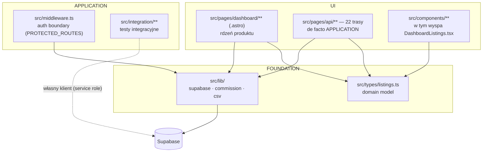

# EstateDesk — Mapa projektu

> Wygenerowano: 2026-06-09 · Odświeżono i przebudowano: 2026-06-10 (po PR #27, #28)
> Synteza z: `artifact-1-territory.md` · `artifact-2-structure.md` · `artifact-3-contributors.md`
> Okno analizy: 12 miesięcy historii gita (172 commity na main; 208 z gałęziami)

---

## 1. TL;DR

EstateDesk to aplikacja Astro + Supabase do zarządzania ofertami nieruchomości: CRUD listingu, ceny, prowizje, kontakty, dokumenty i cykl zamknięcia transakcji. Praca skupia się niemal w całości wokół jednej domeny — `src/pages/dashboard/listings/` i `src/pages/api/listings/` odpowiadają za większość aktywności z całego okna analizy. Architektura warstwowa (FOUNDATION → APPLICATION → UI) jest czysta: zero cykli importów i zero naruszeń granic, ale całość spinają dwa huby — `src/types/listings.ts` (domain model, 9+ konsumentów cross-layer) i `src/lib/supabase.ts` (29 konsumentów, nietesowalny bez Astro runtime). Najsłabszy punkt to pokrycie tras API: bezpośrednio przetestowane są 4 z 22, a najtrudniejsza logika (`close.ts`, `commission/set.ts`) jest pokryta tylko przez e2e lub wcale. Projekt ma dwóch ludzkich kontrybutorów i jednego AI (Claude — faktyczny autor ~106 commitów logiki), więc bus factor wynosi 1 niemal wszędzie. Uwaga metodyczna: najaktywniejsza warstwa projektu (`.astro`) jest niewidoczna dla grafu zależności — szczegóły w sekcji Ograniczenia.

---

## 2. Teren — duża odpowiedzialność vs peryferia

### Klasyfikacja (etykieta + dowód)

| Obszar | Rola | Głębokość | Profil zmian | Dowód |
|---|---|---|---|---|
| `src/pages/dashboard/listings/[id]/` | core | deep (`pricing`, `close`) / shallow (reszta) | volatile — top aktywności | 38+ zmian w 12 mies., 5 plików w top-10 (artifact-1) |
| `src/pages/api/listings/` | core | przeważnie shallow (cienki CRUD); deep: `close.ts`, `commission/set.ts` | stabilizuje się po peaku W22 | 32 zmiany; `close.ts` = 4 zapytania DB + komisja (artifact-2) |
| `src/types/listings.ts` + `src/lib/` | core, contract layer | shallow w kodzie, load-bearing w grafie | stable, zmiany rzadkie ale wysokokosztowe | 9+ / 29 konsumentów (artifact-2) |
| `src/middleware.ts` + `src/pages/api/auth/` | supporting | shallow | seasonal — wraca przy każdym nowym widoku | 7 obszarów co-change (artifact-1) |
| `src/integration/`, `e2e/` | supporting (harness) | — | volatile w tygodniach "testowych" | 38 zmian łącznie (artifact-1) |
| `help.astro`, `index.astro`, `lib/config-status.ts` | peripheral | shallow | stable | brak importów, brak co-change |

### Aktywność w czasie

Powtarzalny cykl tygodniowy: **feature → UI polish → testy → kolejny feature** (pełna tabela tygodniowa w artifact-1). Ostatni cykl (W24, 08–10.06): live filtering (PR #26) → eksport CSV (PR #27) → help page (PR #28). Sygnał: feature'y zaczęły przychodzić jako PR-y autorstwa cieyhomelab, nie commity Macieja.

---

## 3. Realne powiązania — co naprawdę zmienia się razem

Przy każdym sprzężeniu podajemy źródło dowodu, bo graf i historia gita widzą różne rzeczy:

| Sprzężenie | Źródło dowodu | Co to znaczy przy zmianie |
|---|---|---|
| `types/listings.ts` → cały stack | graf importów **i** git co-change (11 obszarów) — oba źródła zgodne | zmiana pola `Listing` = jeden commit przez wszystkie warstwy |
| `lib/supabase.ts` ← 29 konsumentów | graf importów (23 wg depcruise + 6 widocznych tylko grepem w `.astro`) | zmiana interfejsu klienta = ręczna weryfikacja 29 miejsc |
| `pricing.astro` ↔ `edit.astro` (tandem) | **tylko** git co-change — graf nie widzi `.astro` | de facto jedna funkcjonalność na dwóch stronach; zmieniaj parą |
| `middleware.ts` ↔ niezwiązane feature'y (7 obszarów) | git co-change; w grafie importuje tylko `lib/supabase` | sprzężenie proceduralne (ręczny wpis `PROTECTED_ROUTES`), nie importowe |
| `DashboardListings.tsx` ↔ `lib/csv.ts` | graf importów + git (PR #27) | nowy tandem: komponent + wyekstrahowana logika eksportu |
| `integration/helpers` ↛ `lib/supabase.ts` (celowy BRAK importu) | graf importów | testy używają innego klienta (service role) — możliwy cichy rozjazd konfiguracji cookie |

**Cykle:** brak w warstwie TS/TSX (depcruise); warstwa `.astro` sprawdzona grepem — brak cross-page importów, ale to słabszy dowód (patrz Ograniczenia).

---

## 4. Strefy ryzyka

| # | Strefa | Dlaczego (jedna linijka) |
|---|---|---|
| 1 | `api/listings/[id]/commission/set.ts` | Pieniądze + dwóch autorów + poprawki bez opisu (`1eff78ad`, `465a157`) = najwyższe ryzyko cichej regresji. |
| 2 | `api/listings/[id]/close.ts` | Najtrudniejsza trasa (4 zapytania DB + komisja + null-guardy), pokryta wyłącznie e2e. |
| 3 | `middleware.ts` / `PROTECTED_ROUTES` | Ręczna lista — nowa strona bez wpisu jest publiczna; PR #28 potwierdził, że wpis trzeba pamiętać. |
| 4 | `supabase/migrations/` | Bus factor 1, decyzje schematu tylko w commitach; `registration_open_rpc.sql` bez PR i opisu. |
| 5 | `api/format-address.ts` | Jedyna zewnętrzna integracja (LLM przez OpenRouter), 9 ścieżek błędów, zero testów. |
| 6 | `lib/supabase.ts` | Hub 29 konsumentów nietesowalny bez runtime; testy chodzą innym klientem niż produkcja. |

Pełna lista ryzyk testowych (R1–R8) z zaleceniami: `artifact-2-structure.md`.

---

## 5. Kogo zapytać

| Strefa | Kandydaci | Dopasowanie |
|---|---|---|
| Komisje / pricing | Maciej (autor logiki i schematu); cieyhomelab (autor poprawek `1eff78ad`, `304cdc6` — tylko on wie, co naprawiał) | obie osoby konieczne przy audycie `set.ts` |
| Auth / middleware | Maciej (signup, 3-user limit, RLS); cieyhomelab (restrukturyzacja auth check, wpis `/help`) | historia decyzji 3-user limit: sekwencja 3 commitów |
| Migracje DB | tylko Maciej | brak drugiej osoby — przed zmianą schematu czytaj pliki `.sql` |
| CI/CD / deploy | cieyhomelab (stworzył `deploy.yaml`); Maciej (przerabiał: migration step, audit gate) | wiedza rozdzielona — pytaj obu |
| Testy / harness | Maciej (wyłączny autor strategii) | decyzja "bez mocków DB" nieudokumentowana poza kodem |

**Zastrzeżenie:** ~106 commitów logiki biznesowej jest co-authored przez Claude — dla części kodu nie istnieje człowiek, który rozumie ją niezależnie od sesji. Pozostają commity, testy i artefakty w `context/changes/`.

---

## 6. Pierwszy dzień — co przeczytać, w tej kolejności

1. `src/types/listings.ts` — domain model; wszystko inne konsumuje te typy.
2. `src/lib/supabase.ts` — jedyny klient DB; cookie-auth i sprzężenie z Astro runtime.
3. `src/middleware.ts` — granica auth; zrozum `PROTECTED_ROUTES`, zanim dodasz stronę.
4. `src/pages/dashboard.astro` — integration point UI: API + komponenty + typy.
5. `src/pages/api/listings/create.ts` — kanoniczny kształt trasy API (wzorzec z CLAUDE.md §2).
6. `src/pages/api/listings/[id]/close.ts` — najtrudniejsza logika domeny; czytaj z `e2e/close-reopen-lifecycle.spec.ts` jako specyfikacją zachowania.
7. `src/lib/commission.ts` + `commission.test.ts` — wzorzec ekstrakcji logiki biznesowej (tak samo zrobiono później z `csv.ts`).
8. `supabase/migrations/` (przegląd chronologiczny) — jedyne źródło prawdy o schemacie i RLS.

---

## 7. Ograniczenia — czego ta mapa NIE mówi

- **Okno czasowe:** 12 miesięcy historii gita, snapshot na 2026-06-10. Aktywność = dowód w oknie, nie stan na zawsze.
- **`.astro` poza grafem zależności:** dependency-cruiser nie parsuje plików `.astro` — najaktywniejszy obszar projektu (`pages/dashboard/**`) nie ma automatycznego grafu. Obserwacje o stronach pochodzą z grepa; to **unknown**, nie "brak powiązań".
- **Graf statyczny nie widzi runtime couplingu:** zmienne z `astro:env`, polityki RLS w bazie, Supabase Storage, trigger-y SQL — nic z tego nie jest w grafie importów.
- **Co-change to historia, nie kontrakt:** tandem `pricing`/`edit` pokazuje, co zmieniało się razem; nie pokaże kontraktu, który *powinien* być synchronizowany, a nie jest.
- **Mapa nie ocenia poprawności kodu** ani słuszności decyzji (np. strategii "bez mocków DB") — mówi gdzie patrzeć i gdzie uważać.
- **Brak sygnałów z produkcji:** zero observability — failure rate `format-address.ts`, koszty OpenRouter i zachowanie deploya przy błędnej migracji są nieznane (pełna lista unknowns: artifact-3).

---

_Następny krok (Deep Focus): #1–#2 ze stref ryzyka — audyt `commission/set.ts` + integration test dla `close.ts`; alternatywnie szybka wygrana: unit testy filtrów w `DashboardListings.tsx` (wzorzec ekstrakcji już jest — `lib/csv.ts`)._
